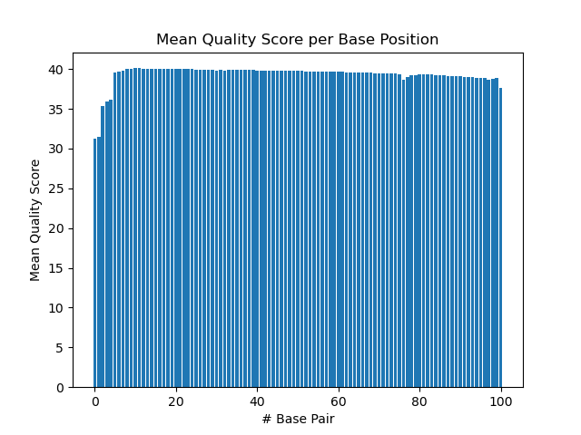
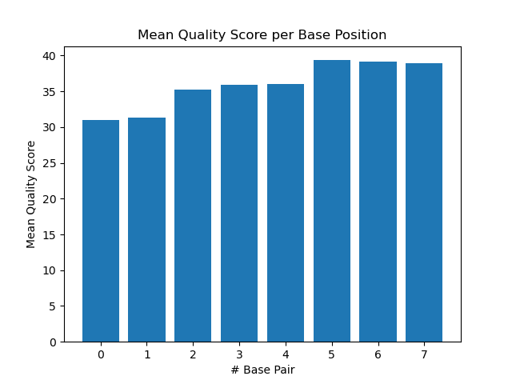
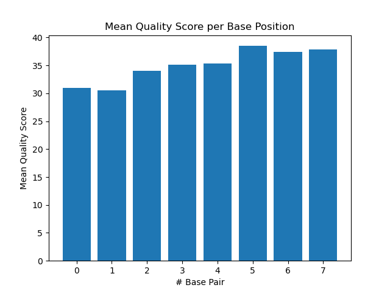
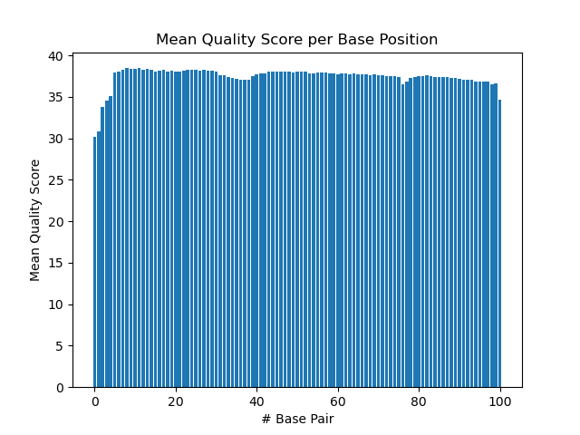

# Assignment the First

## Part 1
1. Be sure to upload your Python script. Provide a link to it here: \
[qscore distribution python script](qscore_dist_demult.py)

| File name | label | Read length | Phred encoding |
|---|---|---|---|
| 1294_S1_L008_R1_001.fastq.gz | read1 | 101 | phred-33 |
| 1294_S1_L008_R2_001.fastq.gz | index1 | 8 | phred-33 |
| 1294_S1_L008_R3_001.fastq.gz | index2 | 8 | phred-33 |
| 1294_S1_L008_R4_001.fastq.gz | read2 | 101 | phred-33 |

2. Per-base NT distribution
    1. Use markdown to insert your 4 histograms here. \
     \
     \
     \
     \

    2. 
    ```
    I would be more stringent on the quality score cutoff for the indexes than the biological reads. To achieve this, I would look at the quality score of every single base in the index read and unless every base is above the cutoff, I would not keep it in the matched category. In contrast, I would use the average quality score of an entire read (101 values) to see if it meets the cutoff. Based on the histograms produced above, I would make a quality score of 35 the cutoff for both indexes and reads. The lowest quality scores are between Q30-Q35. All other reads are above Q35. 
    ```
    3. ```zcat 1294_S1_L008_R2_001.fastq.gz | grep -A1 --no-group-separator "^@" | grep -v "^@" | grep -c -o "N"``` \
    Output: ```3976613``` \
    ```zcat 1294_S1_L008_R3_001.fastq.gz | grep -A1 --no-group-separator "^@" | grep -v "^@" | grep -c -o "N"``` \
    Output: ```3328051```
    
## Part 2
1. Define the problem
```
The reads were multiplexed when sequenced, meaning many different samples (from different conditions or organisms potentially). We need to re-group (demultiplex) the reads again using the indexes they carry, which are unique to each group. We also need to filter out reads where index on read1 does not match index on read2, or reads with indexes with low quality scores to optimize confidence in our categorization of reads into the various index groups. 
```
2. Describe output
```
Output should be 2 fastq files per index match (one for read1 and another for read2). Since there are a total of 24 possible indexes here, we expect a total of 48 fastq files where indexes match on read1 and read2. Also, 2 fastq files to hold all unknown (indexes containing N or low quality score) reads (keeping read1 and read2 separate). Finally, 2 fastq files to hole all unmatched (index1 and index2 do not contain Ns but they do not match each other) reads (keeping read1 and read2 separate). In total, we expect 52 fastq files. 
```
3. Upload your [4 input FASTQ files](../TEST-input_FASTQ) and your [>=6 expected output FASTQ files](../TEST-output_FASTQ).
4. Pseudocode \
Located here: [Pseudocode](part2_pseudocode.py)
5. High level functions. For each function, be sure to include:
    1. Description/doc string
    2. Function headers (name and parameters)
    3. Test examples for individual functions
    4. Return statement
